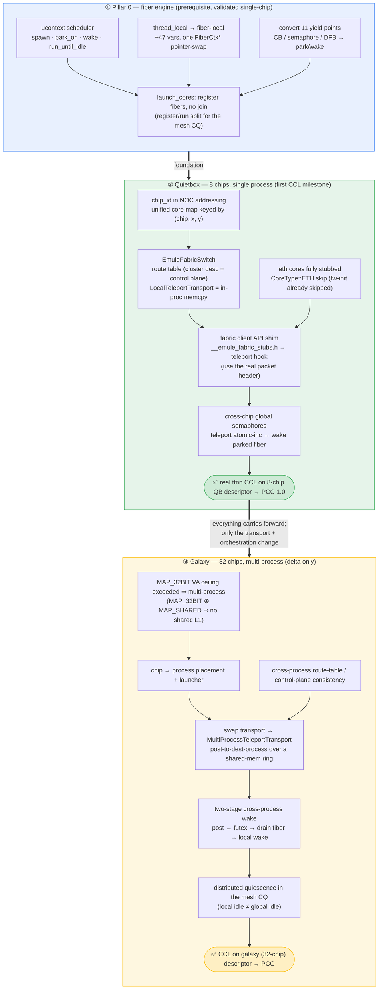

# tt-emule multi-chip / fabric / CCL — design docs

**Status: DESIGN ONLY — no emule code has been changed.** These are research + design + planning documents
for extending tt-emule from single-chip to multi-chip, so it can run real ttnn (and tt-blaze) CCL workloads.
The end goal is **8-chip quietbox CCL**, with a path to quad (128 chips) and multi-host (up to 36 galaxies).

## Reading order

1. **[ttsim-methodology.md](ttsim-methodology.md)** — code-grounded account of how the upstream functional
   sim (ttsim) does multichip: compile-time `ETH_PEER_TABLE`, single-hop raw-eth delivery, **no fabric**.
2. **[craqsim-methodology.md](craqsim-methodology.md)** — code-grounded account of craq-sim (the ttsim fork
   that is tt-metal's production `SIMULATION` backend): real ERISC execution, a **real multi-hop fabric
   router**, plus a host-inject "teleport" mode. The closest existing analogue to what emule will do.
3. **[scaling-architecture.md](scaling-architecture.md)** — the emule scaling architecture: the three
   orthogonal axes (execution engine / address space / transport), the **fiber work-chunking keystone
   (Pillar 0)**, and the phased path (quietbox → quad → multi-host).
4. **[pillar0-fiber-engine.md](pillar0-fiber-engine.md)** — the detailed design of the Pillar-0 fiber
   engine that §6 of the scaling architecture introduces: `ucontext` stackful fibers, the
   `thread_local`→fiber-local migration, the yield-point conversion, and the `launch_cores` rewrite. The
   load-bearing prerequisite for multi-chip; validated on single-chip regressions before any multi-chip work.
5. **[fabric-ccl-simulation.md](fabric-ccl-simulation.md)** — the fabric/CCL data-path deep-dive and the
   recommended emule design: intercept at the **fabric client API** and **teleport** to the final
   destination (no router, no eth-core execution, no multi-hop).
6. **[fabric-ccl-op-coverage.md](fabric-ccl-op-coverage.md)** — which mocking level covers the full ttnn
   **and tt-blaze** op surface. Conclusion: the fabric client API is a single kernel choke point for both;
   blaze exercises a wider surface (stateful sends, `RoutingPlaneConnectionManager`, sockets-over-fabric).
7. **[implementation-plan.md](implementation-plan.md)** — the culmination: a phase-by-phase, code-level plan
   to implement 8-chip quietbox CCL, including a detailed comparison vs ttsim + craq-sim.

## The headline answers (for the impatient)

- **What level of mocking?** The **fabric client API** (`WorkerToFabricEdmSender`), via emule's existing
  jit_hw shadow stubs — the highest interception point, above the router and ETH_TXQ.
- **How is interchip comm routed?** **Direct teleport to the final destination chip** (no multi-hop, no
  router), resolved from the packet header + a route table built from the cluster descriptor; deliver by
  in-process `memcpy` + atomic-inc + wake.
- **Do we execute the ethernet cores?** **No — completely stubbed.** Fabric firmware init is already skipped
  in emule mode, so the router never runs; CCL workers (tensix) run natively and their fabric sends are
  shimmed to teleport.

## Roadmap: the steps to run a CCL (quietbox → galaxy)

Bottom-up. **Pillar 0** (the fiber engine) is the foundation, validated single-chip first. The **quietbox**
stack (single process, in-process teleport) builds on it and is the first CCL milestone. **Galaxy** reuses
all of it and adds only the multi-process delta — the `MAP_32BIT` ceiling forces it, and the
`TeleportTransport` seam is where the swap happens (everything else carries forward unchanged).

Doc map: ① [pillar0-fiber-engine.md](pillar0-fiber-engine.md) · ② [implementation-plan.md](implementation-plan.md)
+ [fabric-ccl-simulation.md](fabric-ccl-simulation.md) · ③ [scaling-architecture.md](scaling-architecture.md)
§7–§8 (multi-process is the measurement-gated default end-state). The single-process quietbox → galaxy
multi-process step swaps `LocalTeleportTransport` for `MultiProcessTeleportTransport` behind one interface;
the four orchestration boxes (placement, route-table consistency, cross-process wake, distributed quiescence)
are new work *outside* that seam.

## Key locked decisions (with rationale)

| Decision | Choice | Why |
|---|---|---|
| Interception level | fabric client API shim | single kernel choke point for both ttnn & blaze; keeps native JIT compute |
| Routing | teleport to final dest, no multi-hop | functional correctness needs delivery, not fabric timing; sidesteps craq-sim's 32-chip router trap |
| Ethernet cores | fully stubbed (never execute) | fabric firmware init is already skipped in emule mode |
| CCL scope | fabric-based CCL only | modern ttnn/blaze CCL is fabric-based; legacy per-op EDM is out |
| Fidelity bar | functional correctness (PCC) | not timing/cycle fidelity (that's craq-sim's job) |
| Concurrency | Pillar-0 fibers + block-on-sync | avoids the thread-per-RISC explosion; no global cycle barrier |
| Quietbox process model | single process (8 chips fit `MAP_32BIT`) | preserves emule's direct-L1-aliasing speed |
| End-state address space | **measurement-gated; default multi-process** | quietbox single-process behind the `TeleportTransport` seam; final multi-proc-vs-translation call from the Phase-1 measurement (scaling-architecture §8) |
| Fast dispatch | separate workstream (another agent) | no hard dependency; coordination points flagged |

## Prerequisites & dependencies (important for reviewers)

- **Work-chunking / Pillar-0 fiber engine** — the load-bearing prerequisite (provides cross-device
  concurrency + the wake mechanism). The fabric/CCL docs *assume it is built*; it is now designed in detail
  in **[pillar0-fiber-engine.md](pillar0-fiber-engine.md)** (full M:N `ucontext` fibers, validated on
  single-chip regressions first). Still needs an owner to implement before multi-chip lands.
- **Fast dispatch** — a separate workstream; no hard dependency, but production CCL at scale may softly depend
  on it (see fabric-ccl-simulation.md / scaling-architecture.md).
- **An 8-chip quietbox cluster descriptor** — Phase 0 needs one (T3000/6U-style exists; a true quietbox
  descriptor may need creating).
- Touches the **tt-metal companion** (`emulated_program_runner.cpp`) + emule `jit_hw` shadows — cross-repo.

## Open questions / risks (to resolve during implementation)

- Host-side `ControlPlane` availability in emule mode (needed for op build + the route table).
- 2D `get_next_hop_router_direction` reads device-L1 routing tables the firmware-skip leaves unwritten →
  resolve dest from the explicit header instead.
- The real fabric packet header JIT-compiles cleanly under emule.
- tt-blaze surface (`RoutingPlaneConnectionManager`, stateful sends, `socket_api.h`, worker→forwarder split).

## Explicitly out of scope here

Multi-process / multi-host transport; the Pillar-0 fiber engine's own implementation; fast-dispatch; legacy
EDM CCL; ethernet-core execution; timing/cycle fidelity; host-side mesh CCL (`distribute_tensor` / MPI) and
tt-blaze disaggregation.

## Reference repositories / commits explored (for reproducing file:line citations)

- **tt-metal** — pinned in `tt-emule/tt-metal-pin.txt` (`7b87041b…` at time of writing).
- **craq-sim** — `/localdev/arminale/craq-sim`, `main` @ `dd86e9d1…` (authoritative narrative: its `MULTICHIP.md`).
- **ttsim-private** — `/localdev/arminale/ttsim-private`, `main` @ `d55ebef5…`.
- **tt-blaze** — `/localdev/arminale/tt-blaze` @ `f10d9ee9…` (embeds craq-sim @ `4a96d58c…`).

## Glossary

- **CCL** — collective communication library (all_gather, reduce_scatter, all_to_all, all_reduce, …).
- **Fabric** — tt-metal's inter-chip routing layer; persistent **fabric router** (ERISC) kernels forward
  packets over ethernet. **EDM** = Ethernet Data Mover.
- **Fabric client API** — `WorkerToFabricEdmSender` / `FabricConnectionManager` / `RoutingPlaneConnectionManager`
  / `fabric_async_write`: what a *worker* kernel calls to send over fabric. **emule's interception point.**
- **Teleport** — emule's delivery: decode the packet header, resolve the dest chip, and write directly into
  its L1 (+ atomic-inc + wake), skipping the router and ethernet entirely. The delivery is the
  `TeleportTransport` seam — `LocalTeleportTransport` (in-process, quietbox) vs `MultiProcessTeleportTransport`
  (shared-memory ring, galaxy); see scaling-architecture §8/§10.
- **ERISC / eth core** — the RISC-V core on an ethernet tile that runs the fabric router. **Fully stubbed in
  emule.**
- **Pillar 0 / work-chunking** — the fiber-based execution engine (M:N fibers on a bounded pool) that replaces
  emule's thread-per-RISC model; required to scale and to give cross-device concurrency + wake.
- **`MAP_32BIT` aliasing** — emule's speed trick: a kernel's 32-bit L1 address *is* a host pointer (low 2 GB).
- **Quietbox / galaxy / quad** — 8 chips / 32 chips / 128 chips (4 galaxies), respectively.
- **ttsim / craq-sim** — the upstream functional sim / its heavily-modified fork (tt-metal's production
  SIMULATION backend, which runs the real fabric router).
