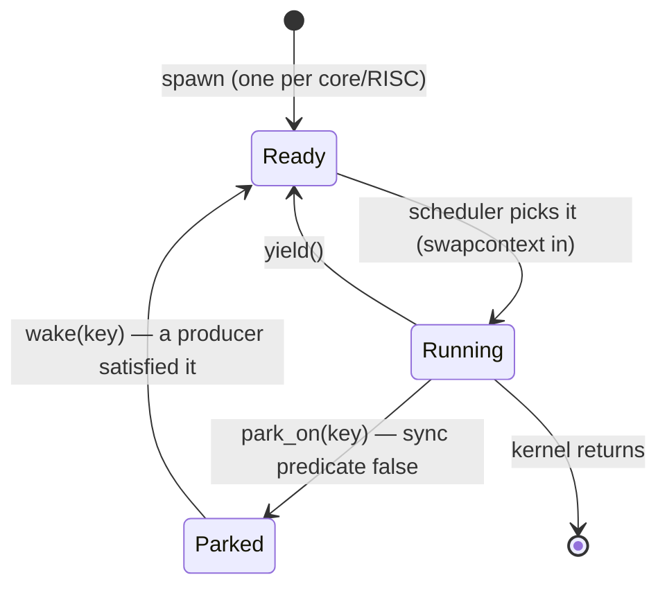

# Pillar 0 — the fiber execution engine

**Status: DESIGN ONLY — no emule code has been changed.** This is the detailed design
for the work-chunking fiber engine introduced in
[`scaling-architecture.md`](scaling-architecture.md) §6. It replaces emule's
OS-thread-per-RISC execution model with cooperatively-scheduled stackful fibers.

Pillar 0 is independently valuable — it removes the thread-count ceiling and the busy-
spin waits of the current model on a **single chip** — and it is the load-bearing
prerequisite for multi-chip: every other `docs/multichip/` doc assumes it exists and
only states the API it needs. It is validated on the **existing single-chip
regressions** (same PCC, far fewer OS threads) before any multi-chip work begins.

**Decision: full M:N stackful fibers.** Build the real scheduler, migrate all per-RISC
`thread_local` context to fiber-local, and convert the blocking sync primitives to
yield/park/wake. The lighter "cooperative threads with a run-permit governor"
alternative was considered and rejected: it keeps native `thread_local` (no migration)
but is bounded by OS thread count and does not reach quad scale.

---

## 1. Why Pillar 0

Today `launch_cores`
(`tt-metal/tt_metal/impl/emulation/emulated_program_runner.cpp:2063-2206`)
spawns an OS thread per core **and** a nested OS thread per RISC, then joins them all
before returning. Kernels are native JIT'd x86, so a kernel can only be suspended two
ways: block its OS thread (today) or run on a **stackful fiber** that can yield.

The thread count is the ceiling:

| Scale | RISC-threads (≈360/WH chip) | Verdict |
|---|---|---|
| 1 chip | ~360 | works today |
| quietbox (8) | ~2,880 | over typical `ulimit -u`; heavy |
| quad (128) | ~46,000 | impossible as OS threads |

A bounded threadpool that runs kernels to completion **deadlocks**: emule kernels block
at sync points (`cb_wait_front`, `Semaphore::down`) and pin their worker, so with P
workers, if P kernels block waiting on data from still-queued kernels, no worker is free
to produce it. Stackful fibers solve this: a blocked fiber **yields** its worker to a
runnable fiber and is re-queued when its condition is satisfied. Fibers are cheap (KB
stacks, parked when idle), so tens of thousands on a few worker threads is fine.

Two wins, even before multi-chip:
- **Thread ceiling removed** — N fibers run on a bounded worker pool (K=1 is enough for
  correctness; the count of fibers no longer maps to OS threads).
- **No busy-spin** — the current `Semaphore::wait` burns up to 10 M spins with
  `sched_yield`/`usleep` backoff (`noc_semaphore.h:94-134`); a parked fiber consumes
  nothing until woken.

And it unblocks multi-chip: all chips' fibers share one runnable pool, so a fiber blocked
on a cross-chip semaphore parks and is woken by delivery — no per-device join ordering
(the cross-chip CCL deadlock in `scaling-architecture.md` §9).

---

## 2. Current execution model (the baseline)

The shape Pillar 0 transforms, all in `emulated_program_runner.cpp`:

- `launch_cores` creates a `std::thread` per core (`:2074`), and inside each, a
  `std::thread` per RISC/kernel-variant (`:2097-2167`); it joins the RISC threads
  (`:2170`) then the core threads (`:2196`). Fully synchronous per device.
- Each RISC thread's prologue (`:2113-2140`) sets the per-kernel `thread_local` context
  (`__rt_args`, `__emule_bridge_l1/dram`, `__emule_cbs`, `my_x/my_y`, `__processor_id`,
  …) and the teardown (`:2158-2166`) clears it.
- The first kernel exception is captured per-RISC/per-core and rethrown after the joins
  (`:2174-2205`).

Synchronization lives in the jit_hw layer:
- **CB** — `CBSyncState`
  (`include/tt_emule/cb_sync_state.hpp`) owns the shared `occupied` atomic + `mu` +
  `space_cv`/`data_cv`. `cb_reserve_back`/`cb_wait_front`
  (`include/jit_hw/api/cb_api.h:117/187`) take a lock-free fast path, then block in
  `__emule_cv_wait(cb.space_cv/data_cv, …)`; `cb_push_back`/`cb_pop_front` bump
  `occupied` and `notify_one`.
- **Semaphores** — `Semaphore::wait/wait_min/down` and `noc_semaphore_wait*` spin on an
  atomic with `sched_yield`/`usleep` backoff, aborting at 10 M iterations
  (`include/jit_hw/api/dataflow/noc_semaphore.h:72-134`,
  `include/jit_hw/api/dataflow/dataflow_api.h:702-755`).
- **DFB** — `dfb_reserve_back`/`dfb_wait_front`/`dfb_finish`
  (`include/jit_hw/api/dfb_api.h`) mirror CB (`dfb_finish` waits *unbounded*).
- **NOC barriers/flushes** — already no-ops (emule NOC is synchronous memcpy):
  `noc_async_read_barrier`, `noc_async_write_barrier`, etc.
  (`dataflow_api.h:508-533`).

Each of today's per-(core, RISC) threads becomes one fiber.

---

## 3. The fiber engine

### 3.1 Backend — custom `ucontext`

Use `getcontext`/`makecontext`/`swapcontext`. It is **safe and free**:
- The only ucontext use today is the SIGFPE handler (`emulated_program_runner.cpp:2001-2058`),
  which only reads/modifies the interrupted context and never uses `sigaltstack` or
  creates contexts — no conflict with using ucontext for scheduling.
- boost.context / boost.fiber are **not** in the build (`third_party/CMakeLists.txt`
  pulls only core/container/smart_ptr/interprocess/asio/lockfree), so a custom ucontext
  scheduler avoids adding a dependency.

Caveat to record: `swapcontext` saves/restores the signal mask via a syscall, making it
slower than boost.context's `fcontext` (~10× per switch). For correctness-first this is
fine; **boost.context is the documented later perf option** if context-switch cost shows
up in profiling.

### 3.2 Scheduler

A process-global `FiberScheduler` living in tt-emule
(`include/tt_emule/fiber_scheduler.hpp` + `src/fiber_scheduler.cpp`), linked into the
runner via `tt-emule::headers`. State:
- a **ready queue** of runnable fibers;
- a **parked map**: `key → list<fiber>`, where `key` is the **host address of the sync
  object** (`CBSyncState*`, or the semaphore atom's pointer). Host addresses are unique
  per-process, so no chip field is needed now and the scheme extends to multi-chip
  unchanged.

API the runner + jit_hw layer need:

```cpp
namespace tt_emule::fiber {
  FiberId spawn(std::function<void()> entry, size_t stack_bytes = kDefaultStack);
  void    park_on(const void* key);   // park the current fiber until woken on key
  void    wake(const void* key);      // re-queue all fibers parked on key
  void    yield();                    // voluntary reschedule
  void    run_until_idle();           // drain; throw first fiber exception; detect deadlock + livelock (§5.6)
}
```

The fiber lifecycle — `park_on`/`wake` replace the OS-thread block/notify of today's model:



`key` is the host address of the sync object (`CBSyncState*` or the semaphore atom).
`run_until_idle` drains until no fiber is Ready **and** none is Parked, and errors out on a
stuck run via the two-tier detector in §5.6 — **tier 1** quiescent deadlock (Ready empty ∧
Parked non-empty) and **tier 2** a global no-progress watchdog for livelock / wake-cycles.

### 3.3 K=1 first, then K>1

This is a **bring-up ordering inside full-fibers**, not a scope cut.

- **K=1 (one worker thread, recommended first).** All fibers run cooperatively on one
  worker, so the ready queue / parked map have **no data races and need no locks**, and
  scheduling is **deterministic**. The thread ceiling is already gone — one worker
  regardless of fiber count, so it scales to quad in *memory* (see §4). Lost wakeups are
  impossible: a producer fiber only runs while the consumer is parked, on the same
  thread, serialized.
- **K>1 (worker pool, later, for wall-clock speed).** Uses the host's many cores. Adds a
  scheduler lock and the **register-then-recheck-under-lock** lost-wakeup guard (classic
  condvar pattern): the lock-free fast-path atomic check stays outside the lock; if it
  fails, take the scheduler lock, re-check the predicate, and only then park. `wake`
  takes the same lock.

Recommendation: build and validate K=1, then enable K>1.

### 3.4 Fiber granularity

One fiber per (core, kernel/RISC) — identical to today's inner per-RISC threads.
`CBSyncState`/`__emule_cbs` stay **shared per-core** across that core's RISC fibers, so a
producer-RISC fiber and consumer-RISC fiber synchronize through the same CB object
(`park_on(&cb)` / `wake(&cb)`), exactly as the threads do today through the CV.

---

## 4. The `thread_local` → fiber-local migration (the crux)

Many fibers time-slice on one OS worker thread, but `thread_local` storage is per-OS-
thread. So every `thread_local` that carries per-RISC/per-kernel context would be shared
(and corrupted) across fibers on a worker. The inventory is **~47 variables across 15
files** (Appendix A).

### 4.1 The mechanism — one pointer swap, not a copy

Keep exactly **one** `thread_local`:

```cpp
thread_local FiberCtx* __emule_fctx;   // the only thread_local; scheduler sets it on swap-in
```

All ~47 variables become members of `FiberCtx`. On every context switch the scheduler
writes `__emule_fctx` to the resuming fiber's context — a **single pointer store**. The
state lives in the fiber's heap-allocated `FiberCtx` permanently; **nothing is copied on
yield**. This corrects the natural misreading of the inventory ("save/restore ~115 KB
per yield") — the 115 KB simply *is* the fiber's, always; only the pointer moves.

### 4.2 Access preserved via macros

To avoid editing thousands of access sites, define each name as a macro into the current
context:

```cpp
#define __emule_dst (__emule_fctx->dst)     // float dst[16][1024]
#define my_x        (__emule_fctx->my_x)     // uint8_t my_x[2]
// … one per migrated variable
```

Existing access sites — `__emule_dst[i][j]`, `my_x[0]` — stay **textually unchanged**;
only the declarations (in emule's own headers) and the `FiberCtx` definition change.
Array members work directly. The tradeoff (a controlled set of `__emule_*`/`__llk_*`/
`my_*` macros) is noted; the alternative — an accessor function — generates the same
code but reads less like the silicon API.

### 4.3 Two classes of state, same mechanism

- **Set-once runner identity (~220 B):** `__rt_args`, `__common_rt_args`, `__core`,
  `__emule_bridge_l1/dram`, `__emule_cbs`, `__emule_dfbs`, `__emule_tc_array`,
  `__processor_id`, `__emule_neo_id`, `__emule_num_threads`, `__emule_my_thread_id`,
  `my_x/my_y`, `__emule_logical_x/y` (`emulated_program_runner.cpp:86-168`). Written once
  in the fiber-entry prologue (which now sets `__emule_fctx->rt_args = …` instead of the
  global) and never mutated during the kernel.
- **Mutated compute/dataflow state (~115 KB):** `__emule_dst[16][1024]` (64 KB), the SFPU
  predication stack + register file (`sfpi.h`, ~7 KB), accumulators (welford/ema/dropout/
  cumsum, ~40 KB), and the per-RISC CB ring pointers `__emule_local_cb`
  (`internal/emule_cb_ptr.h`). Live across yields — a compute kernel holds DST while it
  `cb_reserve_back`s output space.

Both become `FiberCtx` members; the uniform pointer-indirection handles both. (A noted
alternative: keep the set-once subset as plain `thread_local` and restore ~220 B on swap-
in to shrink the macro surface — but uniform indirection is cleaner; recommend uniform.)

### 4.4 Cost

- **Hot path:** one indirection per access. `__emule_fctx` is itself `thread_local`
  (fast, cached) and the context is cache-hot; in tight loops the compiler hoists
  `__emule_fctx->dst` to a local at loop top, so the steady-state cost approaches zero.
- **Memory:** ~115 KB × N fibers (quietbox ≈330 MB; quad ≈5.3 GB). Most of it is
  DST + welford, which only **compute** fibers use, so specialize `FiberCtx` by fiber
  type (compute vs dataflow) to cut the dataflow-fiber footprint substantially.

---

## 5. Yield-point conversion (11 sites)

The conversion pattern is uniform: keep the existing **lock-free fast-path** atomic
check; replace the blocking slow path with `park_on(key)`; have the producer call
`wake(key)` after updating the value. `key` = the sync object's host address.

### 5.1 Circular buffers
`cb_reserve_back` (`cb_api.h:142-153`) and `cb_wait_front` (`cb_api.h:202-213`): replace
`__emule_cv_wait(cb.space_cv/data_cv, …)` with `park_on(&cb)`. The producers
`cb_push_back`/`cb_pop_front` (→ `cb_sync_push`/`cb_sync_pop`, `cb_sync_state.hpp:52-72`)
call `wake(&cb)` in place of `notify_one`. Preserve the `__emule_cb_self_consume_mask`
no-block fast path (`cb_api.h:139`, `:199`) — those CBs never park.

### 5.2 Semaphores
`Semaphore::wait/wait_min/down` (`noc_semaphore.h:72-134`), `noc_semaphore_wait*`
(`dataflow_api.h:702-755`), and the compute-side `ckernel::Semaphore::wait*`
(`compute/experimental/semaphore.h`): replace the 10 M spin loop with `park_on(atom)`
(the atom's host address is the key). The incrementers `up`/`set`/`noc_semaphore_inc`
call `wake(atom)` after the atomic store.

### 5.3 Dataflow buffers
`dfb_reserve_back`/`dfb_wait_front` (`dfb_api.h`) convert like CB. `dfb_finish` (today an
**unbounded** CV wait) parks until `posted == acked`, woken by the ack path.

### 5.4 Barriers / flushes
Already no-ops — no change.

### 5.5 Wake invariants + lost-wakeup
Three invariants keep a *healthy* op from ever spinning, and are what make the detection in
§5.6 tractable:
- **Progress-coupled wake** — `wake(key)` is emitted *only* by a producer that actually
  changed the synchronized state (a `cb_push`/`cb_pop` that moved a page, a real
  semaphore-inc), never speculatively. A wake therefore always reflects real forward
  progress by the waker.
- **Per-key wake (no thundering herd)** — only fibers parked on *that* sync object's host
  address are re-queued; a CB is SPSC, so it is a single waiter, not a herd that all wake
  and re-park.
- **Re-check on resume** — a woken fiber re-evaluates its predicate and re-parks if still
  false; a wake is never "proceed."

**Lost-wakeup:** under K=1 none is possible (single worker, serialized — a producer only
runs while the consumer is parked). Under K>1, the register-then-recheck-under-lock guard
(§3.3) closes the check-then-park race. A lost wakeup that did slip through would leave one
fiber parked forever; once the independent fibers drain, the ready queue empties with it
still parked → caught by tier 1 below.

### 5.6 Hang detection — deadlock, livelock, and the wake-cycle
Poorly-written ops must **error out, not hang**. Two tiers:

**Tier 1 — quiescent deadlock (precise, instant, the common case).** When the scheduler
finds the ready queue empty: if the parked map is non-empty, no fiber can run and (by
progress-coupled wake) no in-flight producer can wake anyone → guaranteed deadlock; throw
immediately. At **K>1** the trigger is *all workers simultaneously idle* ∧ parked
non-empty — a quiescence barrier, not a per-worker check, so a worker mid-fiber is never a
false positive. This catches mutual-wait bugs and the drained lost-wakeup case.

**Can fibers wake each other in a cycle while the real producer starves?** For a *healthy*
op, no: by the §5.5 invariants a woken-but-still-blocked fiber re-parks *without waking
anyone*, so any spurious cycle decays to all-parked → tier 1. **A buggy op can, though** —
e.g. two fibers ping-ponging a semaphore, neither ever completing: the ready queue never
empties, so tier 1 never fires. The existing per-`cb_wait` 120 s timeout (`cb_api.h:109` /
`__emule_cv_wait`) does not catch it either — **it resets on every wakeup**, so a wake-cycle
keeps it alive forever. Hence tier 2.

**Tier 2 — no-global-progress watchdog (livelock / wake-cycle backstop).** Maintain one
**global** progress counter advanced by genuine forward progress — fiber completions
(primary) plus data-publishing events (`cb_push`/`dfb_push` page counts, secondary). Unlike
the per-op timer it is **never reset by an individual wakeup**. If the scheduler runs a
bounded window of fiber resumptions (plus a generous wall-clock backstop — configurable,
replacing the per-op 120 s) with **zero** advance, throw "no global progress — suspected
livelock / lost wakeup." A livelock generates *many* fiber switches with no progress,
whereas a legitimately long compute kernel generates *few* (it runs, it doesn't park) — so
a resumption-count window separates the two. Tier 2 is a **heuristic** (perfect livelock
detection is undecidable): it converts an infinite silent hang into a finite, *diagnosed*
error, though it does not localize the bug as sharply as tier 1. It also catches a fiber
that busy-`yield()`s forever (ready never empties, nothing completes).

**Diagnostic dump (both tiers):** for every parked fiber — chip/core/RISC identity, the
wait-key resolved to a human name (CB id / semaphore L1 address / DFB), the failing
predicate, and the kernel source location — so the op author sees the exact mutual-wait or
the starved producer.

### 5.7 Native data-race detection (TSAN-style)

The other poorly-written-op failure (beyond the hangs in §5.6) is a **data race**: two cores
touch the same L1 with no synchronization ordering them — a kernel that forgets, or
mis-orders, a semaphore / CB handshake. emule can detect these **natively**, reusing
ThreadSanitizer's *algorithm* without its machinery (no external `-fsanitize=thread`).

**TSAN in brief (the algorithm we reuse).** A data race = two accesses to the same location,
from different threads, ≥1 a write, with no **happens-before** (HB) ordering. HB is a partial
order: program order within a thread; *across* threads, an edge exists only through
synchronization (a release-store observed by an acquire-load; a mutex unlock→lock; here, a
**semaphore-inc → semaphore-wait** or **`cb_push` → `cb_wait`**). TSAN tracks HB with **vector
clocks** — each thread holds a per-thread logical timestamp; a *release* stamps the thread's
clock into the sync object, an *acquire* takes the element-wise max back out — plus **shadow
memory** (recent `{thread, clock, is-write}` per location) checked on each access. Real TSAN
injects that check on *every* load/store via compiler instrumentation and shadows every byte —
hence the 5–15× cost. **emule reuses the algorithm but not the per-byte instrumentation.**

**Native design — reuse the algorithm, change the observation point.** emule owns the
scheduler and the sync layer, so the expensive parts come for free:
- **Per-fiber vector clocks** — one VC per (core, RISC) fiber (emule already tracks fibers, §3).
- **HB edges from the silicon primitives** — `cb_push` / semaphore-inc = *release* (stamp the
  fiber's VC into the CB / semaphore shadow); a passing `cb_wait` / semaphore-wait = *acquire*
  (join that VC). The scheduler's own park/wake is **not** an HB edge (the analogue of TSAN's
  `no_sync` switch) — so HB reflects the **silicon** ordering, not emule's cooperative
  interleaving.
- **Shadow per L1 region / CB / semaphore**, not per byte — `{last writer, readers, their VCs}`.
- **Observation = the hooks emule already mediates** — every cross-core access goes through
  them: NOC transactions (`__emule_resolve_noc_addr` / `__emule_multicast_write` — exact
  address, size, direction), CB/DFB pointer **grants** (`get_read_ptr` / `get_write_ptr` carry
  region + read-vs-write intent + fiber, even though the later raw deref is invisible), and the
  sync ops. On each, run the FastTrack-style check: a prior conflicting access from another
  fiber that does *not* happen-before the current one → **race**, throw with a precise report.

**Worked example.** Core A writes payload into region R, then `noc_semaphore_inc`s sem S; core
B `noc_semaphore_wait`s S, then reads R. *Correct:* the inc (release) → wait (acquire) edge puts
A's write before B's read in HB → no race. *Buggy (B omits the wait):* no HB edge → A's write
and B's read are concurrent on R → flagged — **even though**, under K=1, A happened to run
first and B read the right bytes. That is the silicon bug emule would otherwise hide.

**Catches vs misses.** Catches the full *cross-core* surface: publish-before-write, multi-writer
with no arbitration, consume-before-release, CB/semaphore protocol misuse. Misses (vs real
TSAN): byte-precision *within* a granted region; races via raw pointer arithmetic that escapes
the CB/NOC API; purely-local accesses (which can't race cross-core anyway). Byte-level would
require a custom JIT instrumentation pass — i.e. rebuilding the sanitizer — and is out of scope;
going native is what keeps it cheap and sidesteps the external tool's frictions (its fixed
shadow layout would also fight emule's `MAP_32BIT` window).

**Cost & diagnostics.** Only bookkeeping on operations that already pass through hooks, plus one
shadow entry per region (no per-byte shadow) — cheap enough to leave on in CI, unlike real
TSAN. Because emule owns the hooks, a flagged race resolves to src/dst core, CB id / semaphore
L1 offset, and both kernel source locations.

**Shared infrastructure with §5.6.** Race detection (§5.7) and hang detection (§5.6) run on the
same scheduler-owned state (per-fiber clocks + the sync edges at the same yield points), and
both are deterministic and reproducible (the same run flags the same race) — unlike
timing-dependent hardware races. Together they turn a poorly-written op into a **diagnosed
error** instead of a silent wrong answer or a hang.

---

## 6. `launch_cores` rewrite + completion / exceptions

- Replace the per-core/per-RISC `std::thread` spawn + join with
  `scheduler.spawn(fiber_entry)` per (core, RISC). The fiber entry is today's kernel
  lambda body (`:2097-2167`), whose prologue now populates the fiber's `FiberCtx`
  (instead of the global `thread_local`s) before running `ki.variants[t]()`. **No join.**
- **`execute_program_emulated` (single-chip standalone):** register this device's fibers,
  then `run_until_idle()`, then return — preserving the **synchronous** `LaunchProgram`
  contract, so single-chip behavior is identical. Expose the register/run **split**
  (register without draining) so the multi-chip mesh command queue can register all chips
  before one shared drain.
- **Exceptions:** catch at the fiber boundary into the fiber's slot; `run_until_idle()`
  rethrows the first, replacing the per-core/per-kernel rethrow at `:2174-2205`.
- **Stacks:** a per-fiber `makecontext` stack, configurable (default ~1 MB; env override;
  guard page to catch overflow). Kernels are shallow — no recursion, no large stack
  arrays (they use L1/DRAM) — so 1 MB is ample. SIGFPE fires on the current (fiber) stack
  and returns cleanly; install `sigaltstack` per worker for safety if desired.

---

## 7. Bring-up phasing (within full-fibers)

1. **K=1 engine** + the `FiberCtx`/macro migration + the 11 yield conversions. Validate
   on the existing **WH N150 and BH single-chip regressions** — results must be
   bit/PCC-identical, with the OS-thread count collapsed to one worker.
2. **Enable K>1** (worker pool + scheduler lock + lost-wakeup guard) for wall-clock speed;
   re-run regressions.
3. *(Out of scope here)* multi-chip builds on the register/run split and the host-address
   wake keys.

---

## 8. Multi-chip readiness (forward note, not scope)

Pillar 0 needs no multi-chip awareness, but is designed not to block it:
- The **host-address wake key** already generalizes — each chip's `CBSyncState` and
  semaphore L1 has a distinct host address in one process; the eventual multi-process
  case extends the key with a chip field.
- The **register/run split** lets the mesh command queue register all chips' fibers, then
  drive them through one `run_until_idle` (the cross-chip concurrency the CCL ops need).

The chip-keyed core map, the fabric teleport, and the process model are the concern of
[`fabric-ccl-simulation.md`](fabric-ccl-simulation.md) /
[`implementation-plan.md`](implementation-plan.md), not Pillar 0.

---

## 9. Files to create / modify

**New (tt-emule):**
- `include/tt_emule/fiber_scheduler.hpp` + `src/fiber_scheduler.cpp` — the ucontext
  scheduler (`spawn`/`park_on`/`wake`/`yield`/`run_until_idle`).
- The `FiberCtx` definition (in a header the JIT wrapper includes) + the per-variable
  access macros.
- `CMakeLists.txt` — add the scheduler source.

**Modify (tt-emule jit_hw):** the ~47 `thread_local` declarations → `FiberCtx` members +
macros (Appendix A); the 11 yield points in `cb_api.h`, `cb_sync_state.hpp`,
`dataflow/noc_semaphore.h`, `dataflow/dataflow_api.h`, `compute/experimental/semaphore.h`,
`dfb_api.h`.

**Modify (tt-metal companion):** `emulated_program_runner.cpp` — `launch_cores`
(spawn-fiber instead of spawn-thread, no join), the prologue/teardown (write `FiberCtx`),
`execute_program_emulated` (register + `run_until_idle`, with the register/run split),
the exception path (`:2174-2205` → `run_until_idle` rethrow).

Per project rule, update `.claude/references/structure.yaml` for any added source files
or top-level symbols in the same change.

---

## 10. Verification

Design-only here; the doc names the success criteria for the implementation:
- The **existing WH N150 + BH single-chip regressions pass bit/PCC-identical** after the
  thread→fiber conversion (K=1), then again with K>1. Run them sequentially (shared JIT
  cache).
- **Hang detection** errors out (never hangs) on a deliberately-broken sync — a *quiescent
  deadlock* trips tier 1 with the precise parked-fiber dump, and a *wake-cycle / livelock*
  trips the tier-2 no-progress watchdog (§5.6); confirm both, not a 120 s hang.
- **Race detection (§5.7)** flags a kernel that drops a semaphore/CB handshake (write
  without the release→acquire edge) with the src/dst core + CB/semaphore + source lines —
  *even when* the K=1 run produced correct bytes; and stays silent on a correctly-synchronized
  op. Deterministic across runs.
- OS-thread count is bounded by the worker pool (1 at K=1), independent of core/chip
  count — confirm via `/proc/self/status` `Threads` during a run.

---

## Appendix A — the `thread_local` migration surface (~47 variables, 15 files)

Set-once unless noted "**mutated**" (mutated state is live across yields).

**Runner identity** (`emulated_program_runner.cpp:86-168`): `__rt_args`,
`__common_rt_args`, `__core`, `__device`, `__emule_bridge_l1`, `__emule_bridge_dram`,
`__emule_cbs`, `__emule_dfbs`, `__emule_tc_array`, `__processor_id`, `__emule_neo_id`,
`__emule_num_threads`, `__emule_my_thread_id`, `my_x[2]`, `my_y[2]`, `__emule_logical_x`,
`__emule_logical_y`; **mutated:** `__emule_trisc_id` (incremented across compute variants).

**Compute DST + config** (`jit_hw/api/compute/common.h`, `common_globals.h`): **mutated**
`__emule_dst[16][1024]`, `__emule_src_scratch[1024]`, `__emule_pack_offset[32]`,
`__emule_dst_fresh[16]`; set-once `__emule_l1_acc_enabled`, `__emule_dest_accum_en`,
`__emule_pack_relu_mode`, `__emule_pack_relu_threshold`, `__emule_pack_x_end`,
`__emule_pack_face_r_dim`, `__emule_pack_num_faces`, `__emule_pack_num_tiles`.

**SFPU** (`jit_hw/api/compute/.../sfpi.h`): **mutated** `__emule_sfpi_mask[32]`,
`__emule_sfpi_frames[16]`, `__emule_sfpi_frame_depth`, `__emule_sfpi_cursor`,
`__emule_sfpi_dst_fallback[1024]`, `__emule_lreg[16]`, `__emule_prgm_creg[3]`; set-once
`__emule_sfpi_dst_base`.

**Accumulators:** **mutated** `__emule_dropout_rng_state` (`eltwise_unary/dropout.h`),
`__emule_ema_prev[32]` (`ema.h`), `__emule_welford_mean/m2[32]` +
`__emule_welford_grp_mean/grp_m2[128][32]` (`welford.h`), `__emule_cumsum_acc[32]`
(`cumsum.h`), `__emule_cumprod_acc[1024]` + `__emule_cumprod_acc_initialized`
(`cumprod.h`); set-once `__emule_ema_alpha/beta`,
`__emule_quant/requant/dequant_zero_point` (`quantization.h`).

**Dataflow:** **mutated** `__emule_local_cb[32]` (`internal/emule_cb_ptr.h`, CB ring
pointers); set-once `__emule_cb_self_consume_mask` (`cb_api.h`), the NOC set-state caches
(`api/dataflow/noc.h`, `dataflow_api.h`), the never-written NOC counters
(`noc_nonblocking_api.h`), the tilize/matmul config (`internal/llk_state.h`).

(See the exploration report for exact line numbers and types per variable.)
